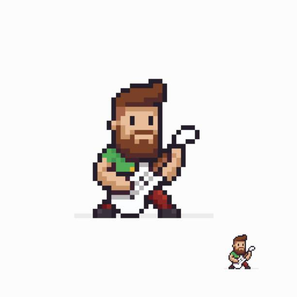
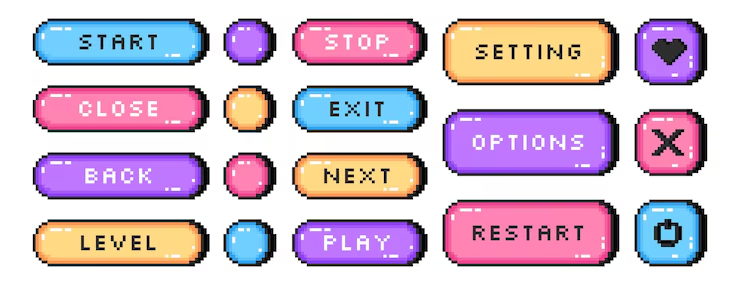
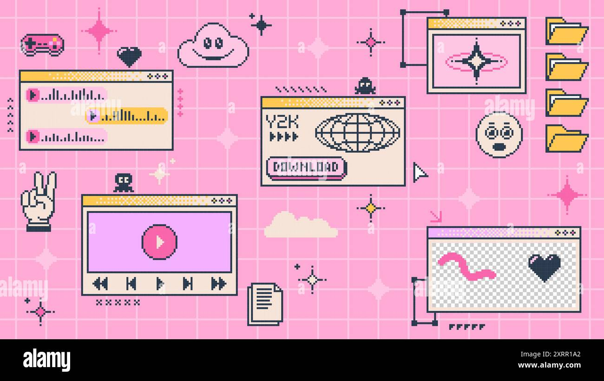
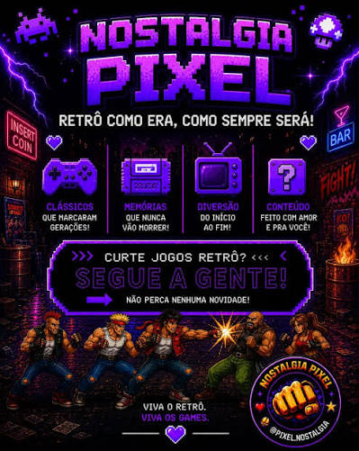

# Tonus — UI/UX Design Guidelines

Related: [Product](PRODUCT.md) · [Gamification](GAMIFICATION.md) · [Architecture](ARCHITECTURE.md)

Target: **M5Stack Tab5**, 5" IPS, **1280 × 720 landscape**, capacitive touch (GT911), ≈ 294 ppi.

---

## 1. Inspiration

| | |
|---|---|
|  | **Character art.** Chunky 1-px outlines, 3–4 tones per material, big head (chibi proportions ≈ 1 : 1.3 head:body), readable at 1× and at large scale. |
|  | **Buttons.** Pill shapes with stepped corners, pastel fills, dark outline, top-left highlight dashes, hard drop shadow. |
|  | **Panels (Bedroom theme).** Retro OS windows with title bars and `○○○` controls, pink grid background, sparkles, folders, cursor details. |
|  | **Mood (Stage theme).** Night-time purple neon, glowing headers, arcade icons, "INSERT COIN" energy. |

> These images are **reference only**. Some are stock images with watermarks. Never ship
> or trace them. All production art is drawn from scratch.

## 2. Principles

1. **Hands-busy first.** The user is holding an instrument. Every in-exercise action needs one tap on a large target, or none.
2. **Readable from the stool.** Key info (BPM, cents, beat) must be readable at 1.5 m.
3. **Celebrate, never scold.** Mistakes show as neutral data. Success gets the sparkle.
4. **One thing per screen.** An exercise screen shows the exercise and nothing else.
5. **Pixel-honest.** Integer scaling, hard edges, a limited palette. No gradients, blur or anti-aliased art.

## 3. Colour tokens

Code references **tokens only**. Hex values live in one theme file.

| Token | Stage (default, dark) | Bedroom (light) | Use |
|---|---|---|---|
| `bg` | `#140C2B` | `#FFB3D6` | Screen background |
| `bg_grid` | `#1F1440` | `#FFCCE4` | Background grid lines (Bedroom) / star field (Stage) |
| `surface` | `#231A45` | `#FFF4E0` | Panels, windows |
| `surface_alt` | `#2F2360` | `#FFE3EF` | Nested panels, list rows |
| `titlebar` | `#9B5CFF` | `#FFD66B` | Window title bars |
| `outline` | `#07040F` | `#1B1B2F` | All outlines, 1 art-px |
| `text` | `#FFF4E0` | `#1B1B2F` | Body text |
| `text_dim` | `#B7A8E0` | `#6B5A7A` | Secondary text |
| `primary` | `#9B5CFF` | `#9B5CFF` | Primary actions, active tab |
| `pink` | `#FF6FAE` | `#FF6FAE` | Highlights, hearts, level-up |
| `cyan` | `#5EC8FF` | `#5EC8FF` | Info, secondary actions |
| `yellow` | `#FFC857` | `#FFC857` | Coins/Picks, stars, warnings |
| `success` | `#6EE7A0` | `#2FA866` | In tune, on time |
| `early` | `#5EC8FF` | `#2B8FD6` | Early hits (with ◀ arrow) |
| `late` | `#FF8A5C` | `#E0602F` | Late hits (with ▶ arrow) |
| `danger` | `#FF4D6D` | `#D93355` | Destructive only (reset save) |

Button fills use the pastel set from reference 02: `cyan`, `pink`, `primary`, `yellow`.
Each has a `*_light` (+20% L) highlight tone and a `*_dark` (−25% L) bevel tone.

**Contrast:** text over fills must reach WCAG AA (4.5 : 1). Dark text (`#1B1B2F`) on all pastel fills.

## 4. Pixel grid and scaling

- **Art-pixel:** game art (characters, backdrops, icons) is drawn at **1 art-px = 4 screen px**
  on a **320 × 180 logical canvas**, which fills 1280 × 720 exactly.
- **UI layout grid:** 4 px base unit. Spacing scale: 4, 8, 16, 24, 32, 48, 64.
- **Character sprite:** 32 × 48 art-px. Shown at ×4 (128 × 192) in lists and ×6/×8 on Home.
- **Icons:** 16 × 16 art-px, shown at ×3 or ×4.
- **Only integer scale factors.** No rotation of pixel art except in 90° steps.
- **Outlines:** 1 art-px `outline`. Corners are stepped (2-3-step staircase), never curved.

## 5. Typography

- **Font:** an OFL-licensed pixel font with full Latin-1 coverage. It **must** render
  `ç ã õ á à â é ê í ó ô ú Á É Ç`. Candidates to evaluate: *Pixelify Sans*, *Silkscreen*.
  Keep the licence in `assets/fonts/`.
- **Scale (px):** `16` caption · `24` body · `32` label/button · `48` title · `96` hero · `160` giant readout.
- **Buttons:** uppercase with +1 art-px letter-spacing (as in reference 02).
- **PT-PT runs ~20–30% longer than EN.** Design every label for the PT-PT length.
- BPM, tuner note and cents use the **giant (160 px)** or **hero (96 px)** size.

## 6. Touch and ergonomics

| Rule | Value |
|---|---|
| Minimum touch target | **96 × 96 px** (≈ 8.3 mm) |
| In-exercise primary target (Start/Stop, Next) | **≥ 160 px tall**, full-width bottom bar or right column |
| Gap between targets | ≥ 16 px |
| Long-press | Only for secondary actions (e.g. clear a drum track); always also available another way |
| Swipe | Never required |
| Count-in | 4 beats (1 bar) visible and audible before every scored exercise |
| Stop anywhere | During playback, a tap on a **large neutral area** pauses (with a 300 ms debounce against accidental brushes from the headstock) |

**Left-handed mode** mirrors the fretboard diagrams and the right-column layout.

## 7. Navigation

```
┌──────┬──────────────────────────────────────────────────────────────┐
│ HOME │                                                              │
│      │                                                              │
│ PRAC │                     content (1144 × 720)                     │
│      │                                                              │
│ JAM  │                                                              │
│      │                                                              │
│ TUNE │                                                              │
│      │                                                              │
│ SHOP │                                                    [⚙ ♥ 1240]│
└──────┴──────────────────────────────────────────────────────────────┘
 136 px left rail: 5 tabs × 128 px, icon + label
```
- At most **2 levels deep**: tab → screen. Modals only for rewards and confirmations.
- The rail **hides during exercises** (the exercise gets the full 1280 px). An **✕ Exit** stays in the top-left.

## 8. Components

| Component | Spec | States |
|---|---|---|
| **Pixel button** | Pill with a stepped corner; 1 art-px outline; highlight dashes top-left (ref 02); **2 art-px hard shadow** bottom-right | default · pressed (no shadow, content shifted +2 art-px) · disabled (`text_dim`, no shadow) · active/toggled (inner outline) |
| **Round icon button** | 96 px circle made of stepped pixels, icon centred | same as above |
| **Window panel** | `surface` body, `titlebar` bar with title + `○○○`, 1 art-px outline, 2 art-px shadow | default · focused (titlebar brighter) |
| **XP bar** | Segmented (one segment = 5%), `pink` fill, `outline` frame, level badge on the left | idle · filling (animated per segment) · level-up flash |
| **Picks counter** | Yellow pick icon + number; bounces when it changes | |
| **Stat badge** | Icon + level number + small progress ring (stepped) | locked · unlocked · newly-levelled (sparkle) |
| **Step cell** (drum grid) | 56 × 56 px, off/on/accent (3 fill tones); current-step column highlighted | off · on · accent · playhead |
| **Chord chip** | Roman numeral big, chord name small ("vi / Am") | default · selected · playing (pulsing outline on beat) |
| **Toast / reward popup** | Window panel sliding in from the top, auto-dismiss after 2.5 s | |
| **Beat indicator** | Row of squares, one per beat; the accent beat is larger; **plus** a screen-edge flash (8 px border) on each beat | off · current · accent |

## 9. Motion

- Sprite animation: **8–12 fps**, stepped, no tweening of pixel art.
- UI transitions: ≤ **150 ms**, moving in whole art-pixels (4 px steps).
- Practice animations are **driven by beat events** from the audio engine, not UI timers.
- **Reward sequence** (≈ 3 s, tap to skip): score stamp → XP bar fills segment by segment
  (tick sound per segment) → Picks drop into the counter → stat badges sparkle →
  level-up fanfare and character jump (if any).
- Respect a "Reduce motion" setting: no screen-edge flash, no confetti.

## 10. Feedback and colour-blind safety

- **Never colour alone.** Early = `early` colour **and ◀**; late = `late` colour **and ▶**;
  in tune = `success` **and** a centred needle + "✓".
- Timing results use words: *"Tight!"*, *"Slightly rushing"*, *"Dragging a bit"*. No "Bad".
- Tuner: the needle moves in stepped 1-cent increments; ±3 cents counts as in tune.

## 11. Sound design (UI)
- Short 8-bit blips: tap (≤ 40 ms), confirm, back, coin, level-up fanfare (≤ 2 s).
- UI sounds have their **own volume** and are **auto-muted during exercises**.
- Never play UI sounds over the metronome.

## 12. Screen wireframes (1280 × 720)

### Home
```
┌──────┬──────────────────────────────────────────────────────────────┐
│ HOME │  BARON VON RIFF              Lv 7  [██████████░░░░] 62%      │
│ PRAC │  Guitarist · Club Headliner             🎸 1240 Picks  💿 2  │
│ JAM  │ ┌────────────────────────────┐  ┌─────────────────────────┐ │
│ TUNE │ │                            │  │ TODAY'S SESSION          │ │
│ SHOP │ │      [ character ×8 ]      │  │ [ 10m ] [ 20m ] [ 30m ]  │ │
│      │ │      in club backdrop      │  ├─────────────────────────┤ │
│      │ │     "Let's jam today!"     │  │ QUESTS          1/3 ✓    │ │
│      │ │                            │  │ ▸ 50 hits @100 BPM       │ │
│      │ └────────────────────────────┘  │ ▸ Name 10 intervals      │ │
│      │ TIM 4  RHY 3  EAR 2  HAR 3  TEC 2   🔥 Streak 5 days       │ │
└──────┴──────────────────────────────────────────────────────────────┘
```

### Exercise run (rail hidden)
```
┌─────────────────────────────────────────────────────────────────────┐
│ ✕  TIMING · Quarter notes                         Bar 3/8   ♪ 100   │
│                                                                     │
│                           ■  □  □  □                                │
│                                                                     │
│                             1 0 0                                   │
│                              BPM                                    │
│        ◀ early   |||||·|||·||█||·|||   late ▶        TIGHT! ±12 ms  │
│ [character ×4 head-bobbing]                                         │
│ ┌─────────────────────────────────────────────────────────────────┐ │
│ │                          ❚❚  PAUSE                              │ │
│ └─────────────────────────────────────────────────────────────────┘ │
└─────────────────────────────────────────────────────────────────────┘
```

### Result / reward
```
┌─────────────────────────────────────────────────────────────────────┐
│                    ★ ★ ★ ☆   TIGHT!                                 │
│   avg ±14 ms · 92% on time · slight rush on beat 4                  │
│   +84 XP  [██████████████░░]  TIMING Lv 4 → 5 ✨                    │
│   +8 🎸                                                              │
│   [character cheering]                                              │
│   [ RETRY ]            [ NEXT ▶ ]              [ DONE ]             │
└─────────────────────────────────────────────────────────────────────┘
```

### Character creator
```
┌─────────────────────────────────────────────────────────────────────┐
│  CREATE YOUR MUSICIAN                              step 4 / 7       │
│ ┌─────────────────────┐  [ SKIN ][ EYES ][ HAIR ][ BEARD ][ FIT ]    │
│ │                     │  ┌───┐┌───┐┌───┐┌───┐┌───┐┌───┐┌───┐┌───┐  │
│ │   [ preview ×8 ]    │  │   ││   ││   ││   ││   ││   ││   ││   │  │
│ │                     │  └───┘└───┘└───┘└───┘└───┘└───┘└───┘└───┘  │
│ │                     │  colour: ■ ■ ■ ■ ■ ■ ■ ■                    │
│ └─────────────────────┘                                             │
│  [ 🎲 RANDOM ]                         [ ◀ BACK ]   [ NEXT ▶ ]       │
└─────────────────────────────────────────────────────────────────────┘
```

### Shop
```
┌──────┬──────────────────────────────────────────────────────────────┐
│      │ SHOP                                     🎸 1240   💿 2      │
│ SHOP │ [ALL][GUITARS][HATS][TOPS][AMPS][STAGES][PETS]               │
│      │ ┌────────┐┌────────┐┌────────┐┌────────┐ ┌─────────────────┐│
│      │ │ [item] ││ [item] ││ [item] ││ 🔒 Lv12│ │ [preview on     ││
│      │ │ 150 🎸 ││ 300 🎸 ││ OWNED  ││ 900 🎸 │ │  character ×6]  ││
│      │ └────────┘└────────┘└────────┘└────────┘ │ Paulsen Goldtop ││
│      │ ┌────────┐┌────────┐┌────────┐┌────────┐ │ RARE · 300 🎸   ││
│      │ │  ...   ││  ...   ││  ...   ││  ...   │ │ [  BUY  ]       ││
│      │ └────────┘└────────┘└────────┘└────────┘ └─────────────────┘│
└──────┴──────────────────────────────────────────────────────────────┘
```

### Jam Room
```
┌──────┬──────────────────────────────────────────────────────────────┐
│      │ JAM   Style: [FUNK ▾]  Key: [E ▾] [minor]   ♪ 96  swing 20%  │
│ JAM  │ KICK  ■□□□ □□■□ ■□□□ □□□□                                  │
│      │ SNARE □□□□ ■□□□ □□□□ ■□□■                                  │
│      │ HAT   ■■■■ ■■■■ ■■■■ ■■■■   (…8 tracks, scroll)            │
│      │ CHORDS [ i Em ][ iv Am ][ VII D ][ i Em ]   bars: 4          │
│      │ SCALE  E minor pentatonic  [mini fretboard]                  │
│      │ [ ▶ PLAY ]   BASS [on]  PAD [on]  DRUMS [on]                 │
└──────┴──────────────────────────────────────────────────────────────┘
```

### Tuner
```
┌──────┬──────────────────────────────────────────────────────────────┐
│      │ TUNER  [Guitar · E standard ▾]  A4 = 440 Hz                  │
│ TUNE │                                                              │
│      │                          A                                   │
│      │                   ◀ -12 cents                                │
│      │     ┆┆┆┆┆┆┆┆┆┆┆┆┆┆┆┆┆█┆┆┆┆┆┆┆┆┆┆┆┆┆┆┆                         │
│      │  [E]  [A]  [D]  [G]  [B]  [e]          ✓ tuned: 4/6          │
└──────┴──────────────────────────────────────────────────────────────┘
```

## 13. Accessibility checklist (every screen)
- [ ] All colours come from tokens; text contrast ≥ 4.5 : 1
- [ ] Targets ≥ 96 px; exercise primary action ≥ 160 px tall
- [ ] No information shown by colour alone
- [ ] All strings come from the i18n tables; layout checked with PT-PT
- [ ] Works with Reduce motion on
- [ ] Integer-scaled art only
